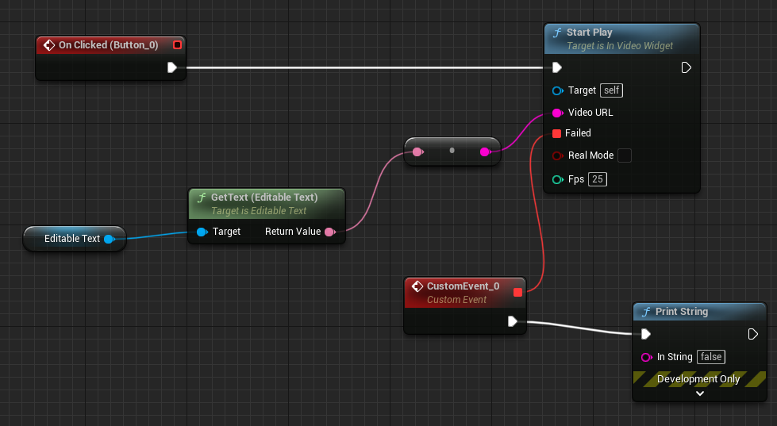
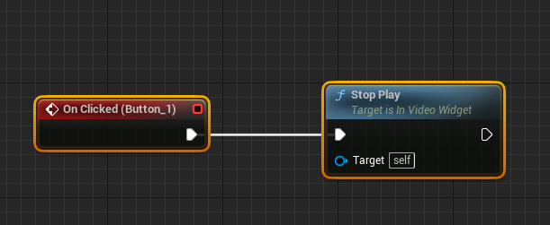
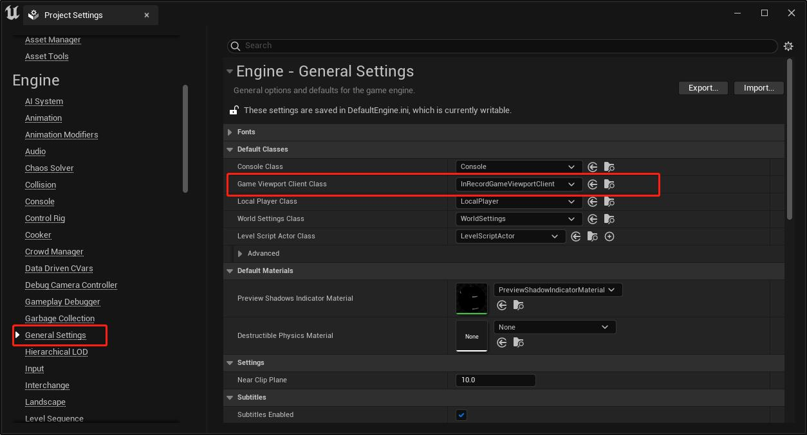
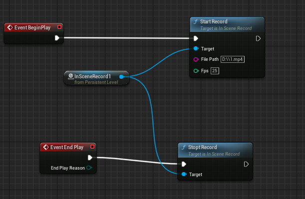

# InVideo

## 工具介绍

1、基于 UE5 实现的 rtsp 的视频播放插件  
2、基于 UE5 实现的运行时输出 mp4 文件

## 学习视频
[(UE5)RTSP摄像头对接指南-实时获取监控画面](https://www.bilibili.com/video/BV1nM1gYEEWv/)  
[(UE5)插件打包后无法运行解决方案](https://www.bilibili.com/video/BV16M1gY7EeK)  

## linux版本
另外我们还推出了基于vlc的linux版本，欢迎加入知识星球获取。  
https://www.bilibili.com/video/BV1iigeekE9P/?vd_source=bf9a6525b21d0736244d8689fc0940f0  

需要获取源码 加入知识星球，这个插件同时支持linux和windows播放  
https://t.zsxq.com/IXemd  

另外知识星球还有海量博主的技术笔记  
# 使用示例

## 1、视频播放示例

参考插件工程 InVideo/Content/NewWorld.umap

播放效果如下：  

### 使用方法

新建一个蓝图 widget 继承自 InVideoWgidget，并新建一个 Image 对象，重新命名为 ImageVideo。  
即可进行调用，可以参考 videoUmg 组件。

打开视频方法  

关闭视频方法  

## 2、运行时输出 mp4

第一步设置默认 viewportclient  

开始录像示例  

# 更新记录

1、2023-05-23 解决了在 5.2 版本崩溃的 bug  
2、2023-06-11 重大更新，实现视频打开和关闭全异步化，不会再阻塞蓝图线程  
3、2024-03-13 修改一个偶发的崩溃bug，在关闭的时候，视频内存被释放，但是渲染队列还在等待渲染的时候触发  
